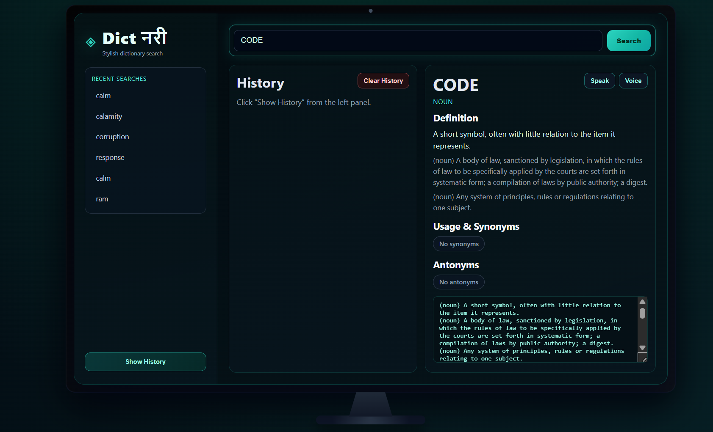

# Dict नरी — Dictionary using API

Modern dictionary app with a React frontend and Flask backend, plus the original Tkinter desktop app preserved.

## Live Deployment

- Frontend (Vercel):https://dictionaryapp-iota.vercel.app/

## Screenshot



> Screenshot is loaded from `docs/Screenshot.png`.

## Features

- Search meanings, part of speech, synonyms, and antonyms
- Voice input support in browser (SpeechRecognition)
- Speak response text (Text-to-Speech in browser)
- Search history with show/hide and clear history
- Responsive dark neon UI
- Original desktop app retained in backend (`backend/Dictionary_.py`)

## Tech Stack

- Frontend: React + Vite
- Backend API: Flask + Flask-CORS + Requests
- Deployment: Vercel (frontend) + Render (backend)

## Project Structure

```text
.
├── backend/
│   ├── Dictionary_.py            # Original Tkinter desktop app
│   ├── api.py                    # Flask API
│   ├── dictionary_service.py     # Core dictionary + history logic
│   ├── requirements.txt          # Desktop/full dependencies
│   ├── requirements-api.txt      # API/deployment dependencies
│   ├── .env.example
│   └── Procfile
├── frontend/
│   ├── src/
│   │   ├── App.jsx
│   │   ├── main.jsx
│   │   └── styles.css
│   ├── .env.example
│   ├── vercel.json
│   └── package.json
├── render.yaml
├── PROJECT_REFERENCE.md
└── README.md
```

## Prerequisites

- Python 3.10+ (recommended 3.11+)
- Node.js 18+ and npm
- Git

## Local Development

### 1) Run Backend API

```bash
cd backend
pip install -r requirements-api.txt
python api.py
```

Backend starts at `http://localhost:5000`.

Optional backend env variables:

- `FRONTEND_ORIGIN=http://localhost:5173`
- `PORT=5000`
- `FLASK_DEBUG=true`

### 2) Run Frontend

```bash
cd frontend
npm install
npm run dev
```

Frontend starts at `http://localhost:5173`.

For local development, `VITE_API_BASE_URL` can be omitted (Vite proxy/local setup handles API calls).

### 3) Build Frontend for Production

```bash
cd frontend
npm run build
```

## Desktop App (Original)

If you want to run the old Tkinter desktop version:

```bash
cd backend
pip install -r requirements.txt
python Dictionary_.py
```

## API Reference

Base URL (local): `http://localhost:5000`

- `GET /api/health`
	- Returns API status.
- `GET /api/search?word=<word>`
	- Returns dictionary response for a word.
- `GET /api/history`
	- Returns search history list.
- `DELETE /api/history`
	- Clears search history.

## Environment Variables

### Backend (`backend/.env.example`)

- `FRONTEND_ORIGIN` = Allowed frontend origin(s), comma-separated
- `PORT` = API server port (Render sets this automatically)
- `FLASK_DEBUG` = `true` / `false`

### Frontend (`frontend/.env.example`)

- `VITE_API_BASE_URL` = Backend API URL, example:
	- `https://your-backend-service.onrender.com/api`

## Deploy to Render (Backend)

### Option A: Using `render.yaml` (recommended)

1. Push repository to GitHub.
2. In Render, create service from blueprint (`render.yaml`).
3. Confirm service root directory is `backend`.
4. Ensure env var:
	 - `FRONTEND_ORIGIN=https://your-frontend.vercel.app`

### Option B: Manual Render Web Service

1. New Web Service from your repo.
2. Configure:
	 - Root Directory: `backend`
	 - Build Command: `pip install -r requirements-api.txt`
	 - Start Command: `gunicorn api:app`
3. Add env var `FRONTEND_ORIGIN`.

## Deploy to Vercel (Frontend)

Current live frontend URL: https://dictionaryapp-9p5omh8z7-nikhilkumar905s-projects.vercel.app/

1. Import repo in Vercel.
2. Set Root Directory to `frontend`.
3. Framework preset: `Vite`.
4. Add env var:
	 - `VITE_API_BASE_URL=https://your-backend-service.onrender.com/api`
5. Deploy.

`frontend/vercel.json` already includes SPA rewrite routing.

## Troubleshooting

- Backend import errors:
	- Reinstall dependencies: `pip install -r backend/requirements-api.txt`
- CORS errors in browser:
	- Ensure `FRONTEND_ORIGIN` exactly matches your frontend domain
- Frontend cannot reach backend:
	- Check `VITE_API_BASE_URL` and backend health endpoint `/api/health`

## Additional Reference

- Full project analysis: `PROJECT_REFERENCE.md`

